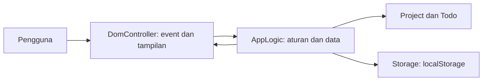
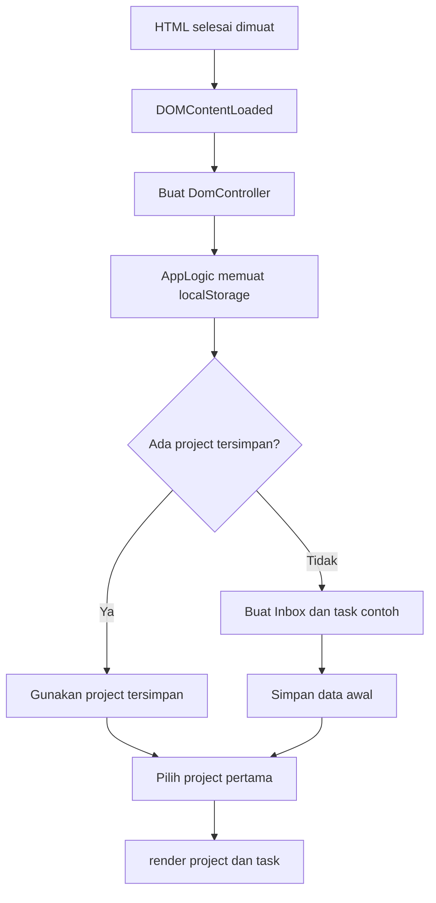

# Alur Logika Aplikasi To-do-do

Dokumen ini menjelaskan bagaimana aplikasi berjalan dari halaman dibuka sampai perubahan project dan task disimpan. Kode utamanya berada di `src/index.js`, `src/appLogic.js`, `src/domController.js`, `src/storage.js`, `src/project.js`, dan `src/todo.js`.

## Gambaran Singkat

Aplikasi memisahkan tiga tanggung jawab:

- **Model data** (`Project` dan `Todo`) menyimpan bentuk serta perilaku dasar data.
- **AppLogic** mengatur data aplikasi: memilih project aktif, menambah/mengubah/menghapus data, dan meminta penyimpanan.
- **DomController** menangani input pengguna dan menggambar ulang tampilan berdasarkan data dari `AppLogic`.
- **Storage** membaca dan menulis data ke `localStorage` browser.

Alur umumnya:



## 1. Saat Halaman Dibuka

1. Browser memuat `src/index.js` dan stylesheet.
2. `index.js` menunggu event `DOMContentLoaded`, yaitu saat HTML sudah selesai dibaca browser.
3. Setelah event tersebut, kode membuat `DomController` dan memanggil `init()`.
4. Ketika `appLogic.js` diimpor, singleton `appState` dibuat. Constructor `AppLogic` langsung menjalankan `init()`.
5. `init()` mencoba memuat project dari `localStorage` melalui `loadProjects()`.
6. Jika belum ada data, aplikasi membuat project `Inbox` beserta satu task contoh, lalu menyimpan data awal.
7. Project pertama dipilih sebagai project aktif.
8. `DomController.init()` memanggil `render()` untuk menampilkan project dan task.



## 2. Bentuk Data

Sebuah project berisi identitas, nama, dan daftar task:

```js
{
  id: "...",
  name: "Inbox",
  todos: []
}
```

Setiap task berisi identitas, judul, deskripsi, tanggal, prioritas, status selesai, dan beberapa data tambahan:

```js
{
  id: "...",
  title: "Tulis laporan",
  description: "Ringkasan mingguan",
  dueDate: "2026-09-29",
  priority: "medium",
  completed: false,
  notes: "",
  checklist: []
}
```

`Project` memiliki `addTodo()` dan `removeTodo()`. `Todo` memiliki `toggleComplete()` untuk membalik nilai `completed` dari `false` ke `true`, atau sebaliknya.

## 3. Menampilkan Data

`DomController.render()` adalah pengatur render utama. Ia memanggil:

- `renderProjects()` untuk menggambar daftar project, jumlah task, dan penanda project aktif.
- `renderTodos()` untuk menggambar judul project aktif dan daftar task-nya.

Sebelum menggambar ulang, fungsi render mengosongkan elemen list. Dengan begitu, tampilan baru selalu dibuat dari state terbaru, bukan ditambahkan di atas tampilan lama.

Jika project aktif tidak punya task, `renderTodos()` menampilkan pesan kosong. Jika ada task, setiap task dibuat sebagai kartu/baris DOM yang memuat checkbox, judul, tanggal, dan tombol hapus. Tanggal ISO diformat menggunakan `date-fns`. Judul serta nama project dilewatkan melalui `escapeHTML()` sebelum dimasukkan ke HTML agar karakter seperti `<` tidak ditafsirkan sebagai markup.

## 4. Project

### Membuat project

1. Pengguna menekan tombol `btn-new-project`.
2. Modal project dibuka.
3. Saat form `form-project` dikirim, handler mencegah reload halaman dengan `preventDefault()`.
4. Nama dibaca dan spasi di awal/akhir dihapus dengan `trim()`.
5. `appState.addProject(name)` membuat objek `Project`, menambahkannya ke array, dan langsung menjadikannya aktif.
6. State disimpan, modal ditutup, kemudian `render()` memperbarui layar.

### Memilih project

Listener klik dipasang pada daftar project, bukan satu-satu pada setiap baris. Teknik ini disebut **event delegation**: klik pada isi baris akan naik ke elemen `<li>` terdekat melalui `closest('.project-item')`. ID project diberikan ke `setActiveProject()`, lalu tampilan dirender ulang.

### Menghapus project

Klik tombol hapus menampilkan konfirmasi. Jika disetujui, `deleteProject()` menghapus project dari array. Project terakhir tidak boleh dihapus. Jika project yang dihapus sedang aktif, project pertama yang tersisa menjadi aktif. Perubahan disimpan dan layar dirender kembali.

## 5. Task

### Menambah task

1. Tombol `btn-new-todo` membuka modal task.
2. Submit form membaca judul, deskripsi, tanggal, dan prioritas.
3. Judul wajib berisi teks setelah `trim()`.
4. `addTodoToActiveProject()` membuat objek `Todo` dan memasukkannya ke project aktif.
5. State disimpan, form direset, modal ditutup, dan tampilan dirender ulang.

### Menandai selesai

Klik checkbox memanggil `toggleTodoComplete(todoId)`. `Todo.toggleComplete()` membalik status selesai. Setelah disimpan, `render()` menggambar checkbox dan gaya task sesuai status yang baru.

### Menghapus task

Klik tombol hapus memanggil `deleteTodo(todoId)`. Fungsi ini mengambil project aktif, menghapus task dari daftar project tersebut, dan menyimpan state jika jumlah task berubah.

### Mengedit task

Klik bagian task selain checkbox atau tombol hapus akan membuka modal detail. `findTodoById()` mencari task pada seluruh project berdasarkan ID. Form edit mengirim nilai baru ke `updateTodo()`, yang menerapkan perubahan menggunakan `Object.assign()`. Perubahan disimpan, modal ditutup, lalu tampilan digambar ulang.

## 6. Penyimpanan Browser

`storage.js` menggunakan key `odin_todo_app_data`:

- `saveProjects(projects)` mengubah object menjadi JSON dan menyimpannya dengan `localStorage.setItem()`.
- `loadProjects()` membaca JSON dengan `localStorage.getItem()` dan mem-parsing-nya.
- Data hasil JSON awalnya object biasa. Fungsi `loadProjects()` membangun ulang setiap project sebagai `Project` dan setiap task sebagai `Todo` agar method class seperti `toggleComplete()` tersedia lagi.
- Operasi storage dibungkus `try/catch`. Jika browser gagal membaca atau menulis storage, error dicatat ke console.

Semua perubahan penting melewati `saveState()`, yang meneruskan daftar project terkini ke `saveProjects()`.

## 7. Siklus Interaksi Umum

Hampir semua aksi mengikuti urutan yang sama:

```text
Input pengguna
    -> event listener DomController
    -> method appState mengubah data
    -> saveState() menulis localStorage
    -> render() membaca state terbaru
    -> DOM diperbarui
```

Contohnya saat task baru ditambahkan:

```text
Submit form
    -> baca dan validasi input
    -> appState.addTodoToActiveProject(data)
    -> Project.addTodo(new Todo(data))
    -> saveProjects(projects)
    -> tutup modal dan reset form
    -> renderProjects() + renderTodos()
```

## 8. Cara Menelusuri Kode

Untuk mempelajari satu aksi, ikuti urutan ini:

1. Cari elemen HTML yang menerima aksi, misalnya `id="btn-new-todo"` atau `id="form-todo"`.
2. Cari listener-nya di `DomController.initEventListeners()`.
3. Ikuti method `appState` yang dipanggil listener.
4. Lihat class model yang mengubah data (`Project` atau `Todo`).
5. Cari pemanggilan `saveState()` untuk mengetahui kapan data persisten disimpan.
6. Lihat `render()` untuk mengetahui bagaimana perubahan state muncul di halaman.

## Catatan Perilaku

- `activeProjectId` hanya menyimpan ID project aktif selama aplikasi berjalan; data project dan task disimpan di `localStorage`.
- Task baru dan project baru otomatis menjadi milik atau pilihan project yang sedang aktif sesuai method yang digunakan. Project baru langsung menjadi aktif.
- Menghapus task dibatasi pada project aktif, sedangkan pencarian task untuk proses edit memeriksa semua project.
- CSS mengatur presentasi visual; aturan bisnis dan perubahan data berada di JavaScript.
